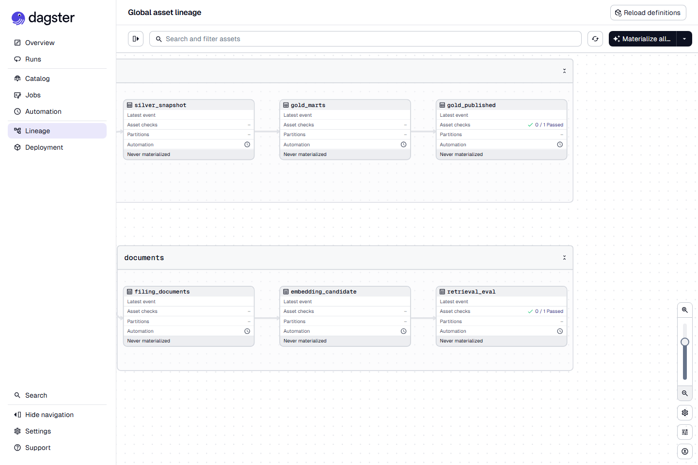

# SEC EDGAR AI-ready data platform

An end-to-end data platform on real SEC filings that treats financial facts
and filing text the way production AI systems need them: **versioned,
point-in-time, with lineage, and behind an evaluation gate.**



*The asset graph from `make dagster`. The two asset checks are the gates: gold is only published when the dbt tests pass, and an embedding index is only promoted when the retrieval eval clears the floor. This is a fresh Dagster instance, so no run history shows; the runs themselves were driven with the Makefile targets.*

* **Lakehouse:** Apache Iceberg tables (bronze/silver/gold) on an S3-compatible
  object store, catalogued through the Iceberg REST catalog locally and AWS
  Glue in the cloud. Every reported version of every XBRL fact is kept with the
  date it became known, so "what did we know on 2025-01-15" is one predicate.
* **Transformation:** dbt with an enforced data contract and custom tests
  (exactly one latest version per fact, validity windows tile, composite keys
  unique). Gold marts are published back to Iceberg for every engine.
* **AI-ready documents:** 10-K/10-Q text chunked by item, content-addressed,
  embedded into pgvector as **immutable index versions**. A new index is a
  candidate until a retrieval evaluation (recall@k, MRR, section-intent hit
  rate) says it is at least as good as the one being served.
* **Serving:** FastAPI with point-in-time fact queries, restatement trails,
  vector search and a RAG `/ask` endpoint that always cites (filing, item,
  chunk, index version). Cost ledger and data-quality scorecard exposed.
* **Orchestration:** Dagster asset graph, quarter-partitioned backfills,
  asset checks, schedules.
* **Infrastructure:** Docker Compose locally (MinIO, Iceberg REST, Postgres +
  pgvector); Terraform modules for AWS, Azure and GCP, all applied and pipeline-verified
  (see status below). Same code on every target.

## What is real here

| Item | Number | Source |
|---|---|---|
| Quarterly SEC datasets loaded | 2 (2025q1, 2025q2) | `silver.processed_manifest` |
| Filings in silver | 13,240 | `silver.submissions` |
| Fact versions in silver | 7,068,425 | `silver.facts` |
| Gold fact versions (after excluding 53 ambiguous filer duplicates) | 7,068,321 | `gold.fact_versions` |
| Facts restated between filings | 17,977 | `gold.restatements` |
| Company reporting periods | 42,674 (6,081 companies) | `gold.company_quarter` |
| Documents chunked | 20 filings (10 companies, 10-K + 10-Q), 4,683 chunks | `docs.documents`, `docs.chunks` |
| Embedding model | BAAI/bge-small-en-v1.5, 384 dims, CPU | `docs.index_versions` |
| Retrieval eval (promoted index, 150 known-item + 23 section-intent queries) | recall@1 0.70, recall@5 1.00, MRR 0.84, section hit@5 0.74, p50 40 ms | `eval/reports/` |
| Offline tests | 16 (moto S3, synthetic zips, gold SQL on DuckDB, chunking, promotion gate) | `pytest -q` |
| dbt | 4 models, 37 tests pass, 1 documented warning | `dbt build` |

Apple's Q2 FY2025 revenue reads $95.359B in `gold.company_quarter`; the
restated-value trail for any fact is one call to `/facts/history`.

## Run it

```bash
cp .env.example .env            # put your email in SEC_USER_AGENT (SEC policy)
docker compose up -d --wait     # MinIO :9000/:9001, Iceberg REST :8181, Postgres :5433
python -m venv .venv && .venv/Scripts/pip install -e ".[dev]"   # Python 3.12
make ingest                     # bronze: latest two quarterly datasets (~200 MB)
make silver                     # Iceberg silver.facts / silver.submissions + DuckDB snapshot
make marts                      # dbt build + publish gold.* to Iceberg
make documents                  # fetch + chunk 10-K/10-Q text for config/companies.yml
make embed                      # candidate index in pgvector
make evaluate                   # eval; promotes or rejects the candidate
make api                        # http://localhost:8080/docs
make dagster                    # http://localhost:3000 asset graph
```

Everything above ran on a laptop against the live SEC endpoints; timings:
ingest ~1 min/quarter, silver ~2 min/quarter, dbt ~1 min, documents ~1 min,
embedding ~15 min on a laptop CPU (4,683 chunks; the local model is free but not fast).

### Example queries

```bash
# what was known about Apple's revenue on 2025-02-15 vs today
curl "localhost:8080/facts?cik=320193&tag=RevenueFromContractWithCustomerExcludingAssessedTax&as_of=2025-02-15"
# the full restatement trail of one fact
curl "localhost:8080/facts/history?cik=320193&tag=Assets&ddate=2024-09-28&qtrs=0"
# biggest restatements this year
curl "localhost:8080/restatements?min_rel_change=0.1&limit=20"
# RAG with citations (extractive answer without ANTHROPIC_API_KEY)
curl -X POST localhost:8080/ask -H 'content-type: application/json' \
  -d '{"question":"What does NVIDIA say about export controls?","cik":1045810}'
```

## Design decisions worth asking me about

**Why keep every version instead of upserting?** Because the value of a
financial fact depends on *when you ask*. Training a model or back-testing a
strategy on today's restated numbers leaks the future. `gold.fact_versions`
gives each version a `[valid_from, valid_to)` window; consumers pick the row
valid on their date. The 17,977 restated facts in two quarters are the reason
this matters.

**Why is the taxonomy version not part of the fact key?** The same fact is
re-reported under `us-gaap/2025` a year after it was reported under
`us-gaap/2024`; those re-reports are exactly the restatement versions we want
to line up. Segments (dimensional slices) *are* part of the key, because
"iPhone revenue" and "total revenue" are different facts.

**Why dbt on a DuckDB snapshot instead of on Iceberg directly?** DuckDB's
Iceberg reader cannot follow pyiceberg's copy-on-write deletes on every
platform. The snapshot is a deterministic Arrow copy that takes seconds for
7M rows; gold is published back to Iceberg, which is what Athena/Spark read.

**Why does a new embedding index have to pass an eval before it is served?**
Re-embedding after a model or chunking change silently changes every answer.
The gate (known-item recall@5 >= 0.80, section-intent hit@5 >= 0.60, no
regression > 0.02 vs the promoted index) turns that into a measured
decision, and the rejected candidates stay in `docs.index_versions` with
their numbers. Rollback is moving one pointer.

**What did the promotion gate actually do?** Three candidates were built; the gate
rejected two of them, and the reasons were real:

| Candidate | known-item recall@5 | section hit@5 | Decision |
|---|---|---|---|
| dense only | 0.71 | 0.50 | rejected: numbers-heavy chunks embed poorly |
| dense + lexical (hybrid, RRF) | 0.97 | 0.48 | rejected: the section-intent eval was itself wrong (10-Q item numbering; long 10-K item headings not detected, so MD&A text was labelled "Item 6") |
| hybrid, after chunker fix | 1.00 | 0.74 | promoted |

The second row is the honest one: the gate said no, the investigation found a
chunker bug and an eval bug, not a retrieval problem. All three rows are in
`docs.index_versions` and `eval/reports/`. The fix regenerated 27 of 150
known-item queries whose expected chunk no longer existed; the eval now does
that automatically when the corpus is re-chunked.

**Why a local embedding model?** 384-dim bge-small embeds the corpus in
minutes on CPU and keeps the whole pipeline free to re-run. The cost ledger
still records the hosted-equivalent price per run so the trade-off is visible.

**What real-world data problems did the SEC files throw?** Rows with a
literal tab inside a text field (about 30 per quarter; counted and skipped),
`accepted` timestamps that gained fractional seconds in 2025, filer-side
duplicates where one filing reports several values for the same fact (53
pairs; excluded from gold and counted in `data_quality.n_ambiguous_facts`
rather than silently picking one), and shell companies whose leverage ratio
is legitimately in the hundreds of thousands (the contract only forbids
negatives).

## Cloud status (honest)

| Target | What happened |
|---|---|
| AWS (account 744359206351, us-east-2) | `deploy/aws` applied: S3 bucket `sec-lakehouse-bass990` (versioned, encrypted, public access blocked, bronze tiering), Glue databases `silver`/`gold`, least-privilege pipeline policy, $10 monthly budget with 80% alert. Pipeline verified against it on 2026-09-30: 2025q2 landed in S3 bronze, loaded into Iceberg silver through the Glue catalog (7,009 submissions, 3,409,904 facts), dbt built the marts from the DuckDB snapshot (37 tests pass, 1 documented warning), and gold was published back to Glue: `company_quarter` 27,520 rows, `fact_versions` 3,409,827, `restatements` 4,271. Athena reads the gold Iceberg tables straight from Glue: `SELECT count(*) FROM gold.company_quarter` returns 27,520 (250 KB scanned, 0.7 s), and Apple's row for the quarter ending 2025-03-31 shows revenue 95.36B and net income 24.78B, which is what the 10-Q reports. |
| Azure (Azure for Students, northcentralus) | `deploy/azure` applied: resource group, ADLS Gen2 account `seclakehousebass990`, filesystem, tiering, budget. The subscription's region policy allows only canadacentral, westus, norwayeast, northcentralus and mexicocentral (documented in the module). Pipeline verified against it: 2025q2 landed in ADLS bronze and loaded into Iceberg silver on ADLS (3,409,904 facts) through the SQL catalog in Postgres. |
| GCP (project stackoverflow-retention, us-central1) | `deploy/gcp` applied: GCS bucket `sec-lakehouse-bass990` (uniform access, public access prevented, bronze to Nearline after 30 days) and BigQuery dataset `sec_lakehouse_gold`. Pipeline verified against it: 2025q2 landed in GCS bronze and loaded into Iceberg silver on GCS (3,409,904 facts) through the SQL catalog in Postgres, with Application Default Credentials. |

## Things that went wrong

I keep this section because the problems below took more of my time than any feature, and each one changed how the code works.

**The fact key.** The first time dbt's uniqueness test ran on `silver.facts`, it came back with 756,916 duplicate rows. I was sure the missing column was `dimh`, the dimension hash the SEC documents for its XBRL data sets, so I added it to the key and reloaded both quarters (about 20 minutes). Same 756,916. I finally pulled the first three lines of `num.txt` out of the zip in MinIO and looked at the header: there is no `dimh` in the Financial Statement Data Sets. That column lives in the Notes data sets, which is what I had been reading about. The column that distinguishes "iPhone revenue" from "total revenue" here is called `segments`. With `segments` in the key the duplicates dropped to 53, and those 53 are real filer errors (one filing reporting several values for the same fact). I exclude them from gold and count them in `data_quality.n_ambiguous_facts` so nobody has to trust that I picked the right one.

**Restated values in the wrong year.** My first `company_quarter` grouped facts by the fiscal year of the filing that carried them. So Apple's FY2023 revenue, restated inside the FY2024 10-K, showed up as a 2024 number. The synthetic-zip test in `tests/test_gold_sql.py` expects the restated 105 in the 2023 row, and it failed. The mart now keys on the fact's own `ddate`, with the fiscal labels joined from whichever filing originally covered that period end. That exposed a second problem, NVIDIA's fiscal-year labels collide across two period ends, which is why the unique key is `(cik, period_end, fp)` and not `(cik, fy, fp)`.

**Two rejected indexes.** The promotion gate for the embedding index refused the first candidate (dense-only, recall@5 0.71 against a floor of 0.80). The queries it missed were chunks full of numbers, which a 384-dimension embedding handles badly, so I added a lexical side with reciprocal rank fusion. That candidate scored 0.97 on recall and then failed the other floor, section-intent hit rate 0.48 against 0.60. I spent an evening on that one. Two causes, both mine: 10-Q filings number their items differently from 10-Ks, so half the intent queries could never match; and my item-heading regex capped the title at 80 characters, so "Item 7. Management's Discussion and Analysis of Financial Condition and Results of Operations" was never detected and the whole MD&A section was labelled Item 6. After fixing the regex and restricting the intent eval to 10-K chunks, the third candidate passed at 1.00 and 0.74. All three rows are still in `docs.index_versions`.

**Three clouds.** AWS applied on the first try. Azure rejected the storage account in five regions with a policy error before I ran `az policy assignment list --disable-scope-strict-match` and read the `listOfAllowedLocations` parameter on the student subscription: canadacentral, westus, norwayeast, northcentralus, mexicocentral, none of which I had tried. The module now defaults to northcentralus and says why. GCP refused the bucket until the project's billing account was reopened. After that each cloud needed its own object-store client behind the same four calls the S3 one exposes, and Azure and GCP needed pyiceberg's SQL catalog because I had no managed Iceberg catalog on either. The same quarter (3,409,904 facts) is loaded on all three.

**The files themselves.** About 30 rows per quarter contain a literal tab inside a free-text field and shift every column after it. The `accepted` timestamp gained fractional seconds in 2025 and broke my parser. DuckDB could not follow pyiceberg's copy-on-write deletes on this machine, which is why dbt runs against a snapshot rather than the Iceberg tables directly. Each of these is handled in code, counted where it matters, and covered by a test with a synthetic zip.

## Layout

```
src/sec_lakehouse/
  config.py              Settings, LAKEHOUSE_TARGET local|aws|azure|gcp
  storage.py             BronzeStore: write-once objects with sha256 manifests
  ingest/edgar_fsds.py   SEC quarterly datasets -> bronze
  lakehouse/catalog.py   pyiceberg catalog per target, ensure_table with explicit partition spec
  lakehouse/facts.py     bronze zip -> silver.facts / silver.submissions (point-in-time model)
  lakehouse/snapshot.py  Iceberg -> DuckDB snapshot; gold -> Iceberg publish
  documents/chunking.py  HTML -> text -> item-aware, content-addressed chunks
  documents/fetch.py     primary documents -> bronze + docs.chunks
  documents/embed.py     candidate index version (incremental)
  documents/evaluate.py  retrieval eval + promotion gate
  documents/db.py        Postgres schema: documents, chunks, index_versions, embeddings, pointer, cost ledger
  serving/api.py         FastAPI
  orchestration/definitions.py  Dagster assets, checks, schedules
transformation/dbt_project/    gold models, contracts, custom tests
eval/                          known_item.jsonl, section_intent.jsonl, reports/
deploy/{aws,azure,gcp}/        Terraform
docs/architecture.md           the long version
```

## Not done / next

* Backfill more quarters (the Dagster partition set goes back to 2020q1; the SEC data to 2009).
* A Spark Structured Streaming path is deliberately absent: EDGAR is a batch
  source. The streaming project is the companion repo.
